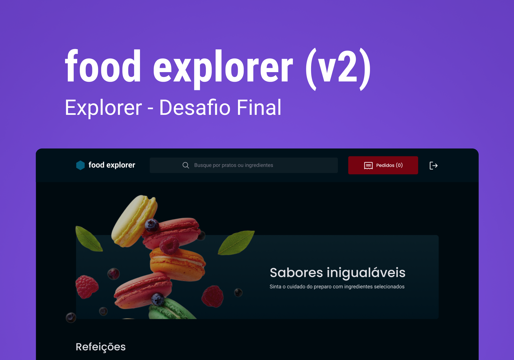

# Food Explorer Frontend



#### Technologies used
- ReactJS
- Styled-Components

#### Features
- [x] Create a dish
- [x] Delete a dish
- [x] Update a dish
- [x] List a dish
- [x] Login
- [x] Register

#### Local setup
*You have to change the backend endpoint at*:
```
*src/services/api.js*,
*src/components/FoodCard/index.jx:23*
*src/pages/Dish/index.jsx:61*
```

```
# Clone the repository with
git clone https://github.com/pedroosz/food-explorer-frontend

# Install dependencies
npm install

# Run the project (on a development environmet)
npm run dev
```

#### Admin credentials
```
Email: admin@example.com
Password: 123456
```

#### Live project
https://food-explorer-frontend-alpha.vercel.app/
